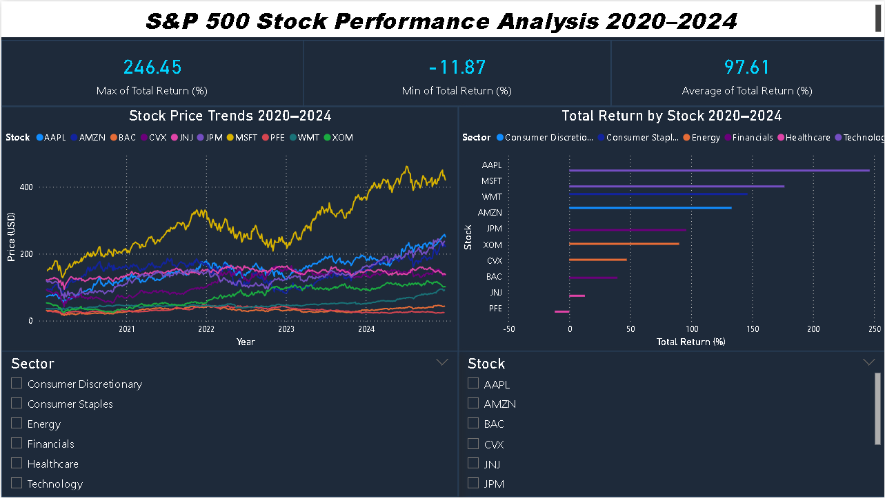

# S&P 500 Stock Performance Analysis (2020–2024)

## Overview
End-to-end exploratory data analysis of 10 S&P 500 stocks across 6 sectors 
from 2020 to 2024, combining Python EDA with an interactive Power BI dashboard.

## Tools & Technologies
- **Python** — Pandas, Matplotlib, Seaborn, yfinance
- **Power BI** — DAX measures, Power Query, interactive slicers
- **Data Source** — Yahoo Finance via yfinance API

## Stocks Analyzed
| Stock | Sector |
|-------|--------|
| AAPL, MSFT | Technology |
| JPM, BAC | Financials |
| JNJ, PFE | Healthcare |
| XOM, CVX | Energy |
| AMZN | Consumer Discretionary |
| WMT | Consumer Staples |

## Key Findings
- **AAPL** was the top performer with **246% total return** over the period
- **PFE** was the worst performer at **-11.87%**
- **Technology sector** delivered the highest average returns
- Volatility spiked significantly across all stocks in **early 2020** (COVID-19)
- Average return across all 10 stocks: **97.61%**

## Python EDA — Visualizations
1. Normalized price trends (base 100)
2. Annual returns by stock (2020–2024)
3. 30-day rolling volatility
4. Sector average return heatmap

## Power BI Dashboard
Interactive dashboard featuring:
- KPI cards — Best, Worst, and Average total return
- Line chart — Stock price trends over time
- Bar chart — Total return by stock colored by sector
- Slicers — Filter by Stock and Sector

## How to Run
1. Clone this repo
2. Install dependencies: `pip install yfinance pandas matplotlib seaborn`
3. Open `sp500_eda.ipynb` in Jupyter Notebook
4. Run all cells top to bottom
